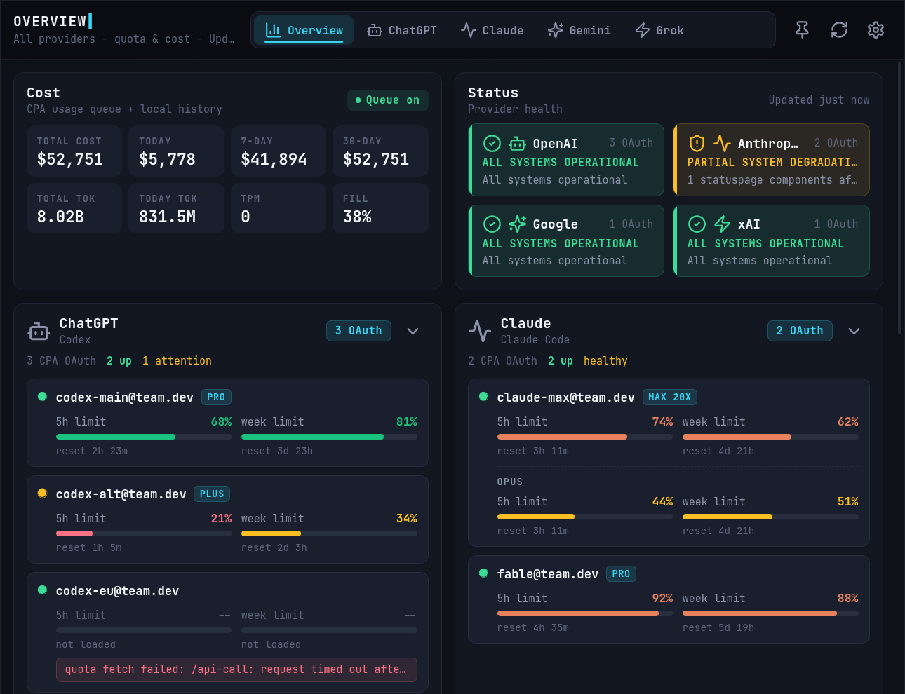
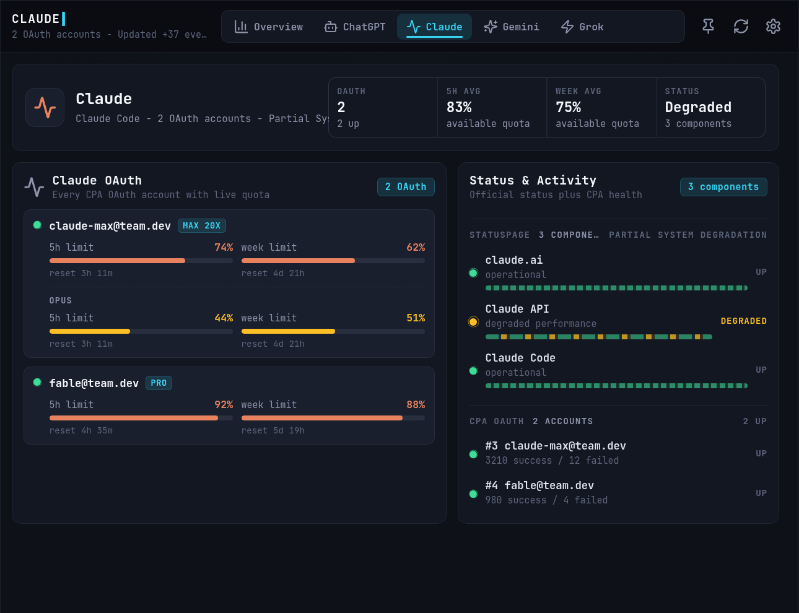
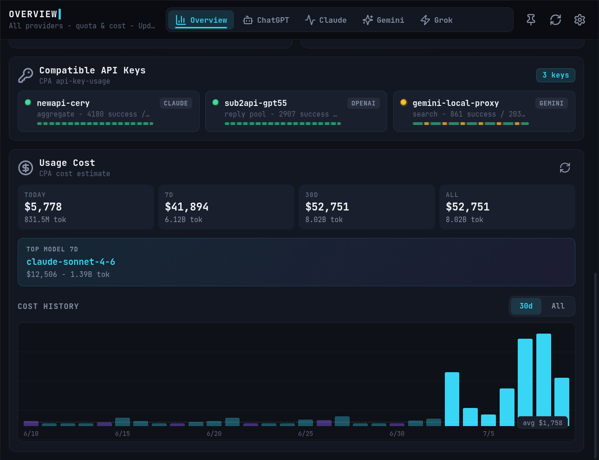

# CLIProxy Quota Tray

Windows 系统托盘面板，搭配 [CLIProxyAPI](https://github.com/router-for-me/CLIProxyAPI)（CPA）使用：
实时查看各 OAuth 账号配额窗口、usage queue 成本估算，以及 OpenAI / Claude 官方状态。

深色终端风 UI，全局 JetBrains Mono（本地内嵌，无需联网加载字体）。



| Provider 聚焦页 | 成本历史 |
| --- | --- |
|  |  |

## 功能

- 常驻系统托盘，点击图标弹出紧凑 dashboard（860×660），失焦自动隐藏，可钉住。
- 从 CPA Management API 读取 OAuth 账号、usage queue、API key usage。
- OpenAI/ChatGPT、Claude、Gemini/Antigravity 显示真实 OAuth 配额窗口（5h / 周 / 月，
  含 Claude 按模型分组的限额）；Grok/xAI 只有 week / month 两个窗口（上游如此）。
- 每个 provider 独立品牌色；配额条、状态点、图表均有入场动效（全部 transform/opacity
  合成层动画，滚动不掉帧；尊重系统"减少动态效果"设置）。
- 配额抓取失败时，账号行会直接显示失败原因（不再只有干巴巴的 "not loaded"）。
- OAuth 与 API key 分开展示；套餐等级只显示在单个账号行，provider 卡片只显示账号数。
- 本地持久化已消费的 usage queue 记录，用于成本统计与 30 天历史柱状图。
- 支持开机自启（首次运行自动注册）。

## 安装

### 方式一：安装器（推荐）

从 [Releases](../../releases) 下载 `CLIProxy-Quota-Tray-Setup-*.exe` 并运行：

- 安装到 `%LOCALAPPDATA%\CLIProxy Quota Tray`（无需管理员权限）；
- 自动结束正在运行的旧实例、创建开始菜单快捷方式，装完自动启动；
- 附带卸载器（出现在系统"应用列表"）。卸载会移除程序与开机自启项，
  但**保留**你的设置与 usage 历史数据。

> 安装器未签名，Windows SmartScreen 会提示"未知发布者"——点"更多信息 → 仍要运行"。

### 方式二：绿色版

下载 Releases 里的 zip，解压后直接运行 `CLIProxy Quota Tray.exe`。

## 首次配置

1. 运行后托盘出现图标，点击打开 dashboard——首次为 **Demo 模式**（假数据），
   顶部有提示。
2. 点右上角 ⚙ 打开 Settings：
   - **CLIProxyAPI Base URL**：你的 CPA 管理地址，例如
     `http://127.0.0.1:8317/v0/management`（只填 `host:port` 也可以，会自动补全路径）。
     CPA 在远程服务器时需要其配置 `remote-management.allow-remote: true`。
   - **Management Key**：CPA 配置里的 `remote-management.secret-key` 明文。
   - **Poll seconds**：自动刷新间隔，默认与最小值均为 `1200`（20 分钟）。
   - **Queue batch**：每次从 usage queue 读取的记录数，默认 `200`。
3. 点 **Save**——连接成功后账号与配额会立刻加载。
4. 若 Cost 卡片显示 "Queue off"，点 Settings 里的 **Enable usage queue**
   开启 CPA 的用量统计（等价于管理 API `PUT /usage-statistics-enabled`）。

> **注意**：CPA 的 `usage-queue` 是消费型队列——读取即取走。本应用会把读到的记录
> 落盘到本地 `%APPDATA%\CLIProxy Quota Tray\quota-monitor\usage-events.jsonl`，
> 后续图表从本地历史计算。同一个 CPA 不要同时开多个消费端，否则成本统计会互相分流。

### 配额刷新语义

- 账号/用量每次轮询都会刷新；**配额窗口默认缓存 20 分钟**（避免频繁请求 OAuth
  provider 端点），点右上角 ↻ 会强制刷新配额。
- 账号行显示 `not loaded` = CPA 还没返回该账号的配额数据；如果抓取出错，
  错误原因会以红字显示在账号行内（常见：CPA 版本过旧没有 `/api-call` 端点、
  CPA 服务器出网被 Cloudflare 拦截、账号 token 过期需要重新登录）。

## 数据来源

CLIProxyAPI Management API：

- `GET /auth-files?all=true` / `GET /usage-statistics-enabled`
- `GET /usage-queue?count=...` / `GET /api-key-usage`
- `POST /api-call`（以 `$TOKEN$` 占位符由 CPA 注入对应账号的 OAuth token）

Provider 配额（经 CPA `/api-call` 代理）：

- ChatGPT/Codex：`https://chatgpt.com/backend-api/wham/usage`
- Claude：`https://api.anthropic.com/api/oauth/usage`（套餐来自 oauth/profile）
- Antigravity/Gemini：Google Cloud Code 配额汇总端点
- Grok/xAI：`https://cli-chat-proxy.grok.com/v1/billing`

官方状态：`status.openai.com` / `status.claude.com` 的 statuspage summary。

## 开发

```bash
npm install
npm run dev            # Vite 开发服务器（纯 UI，无 Electron 桥，自动进 Demo 模式）
npm run electron       # 构建产物 + Electron 运行（真实 CPA 数据）
npm run preview:fake   # 构建 + 假数据预览页 http://127.0.0.1:5199/preview.html
```

假数据预览页支持 URL 参数直达任意 UI 状态：
`?click=tab:Claude`、`?click=settings`、`?click=status:Anthropic`、
`?click=expand:ChatGPT`、`?scroll=1400`。设计规范见 [AGENT.md](AGENT.md)。

## 打包

```bash
npm run package:win    # Vite build + electron-packager → release/CLIProxy Quota Tray-win32-x64/
```

安装器（需要 [NSIS](https://nsis.sourceforge.io/)，Windows 或 Linux 的 makensis 均可）：

```bash
makensis -DSRC="release/CLIProxy Quota Tray-win32-x64" \
         -DOUTFILE="release/CLIProxy-Quota-Tray-Setup.exe" \
         scripts/installer.nsi
```

## 常见问题

**为什么套餐（Pro/Max）不显示在 provider 卡片标题上？**
设计规则：卡片标题只显示 OAuth 数量，套餐只标在单个账号行，避免多账号时误导。

**为什么 Grok 没有 5h limit？**
xAI 的 billing 端点只提供 week / month 两个维度。

**为什么自动刷新不每次都拉配额？**
配额默认缓存 20 分钟，避免频繁请求 provider 端点；手动 ↻ 强制刷新。

**ChatGPT 配额全部 not loaded？**
看账号行里的红字错误。最常见的原因是 CPA 服务器自身访问不了
`chatgpt.com`（数据中心 IP 被 Cloudflare 拦截）——给 CPA 配置出口代理
（`config.yaml` 全局 `proxy-url`，或对应 auth 文件里的 `proxy_url` 字段）即可。

## License

[MIT](LICENSE)
